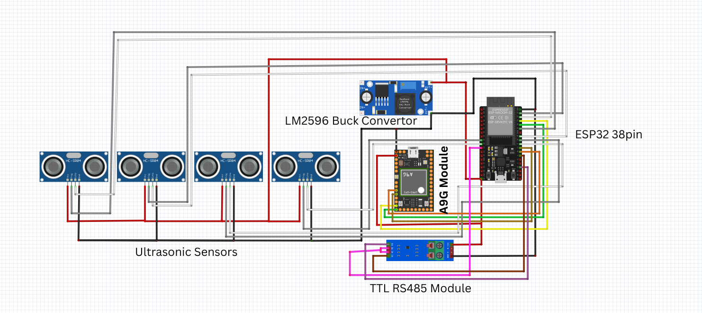
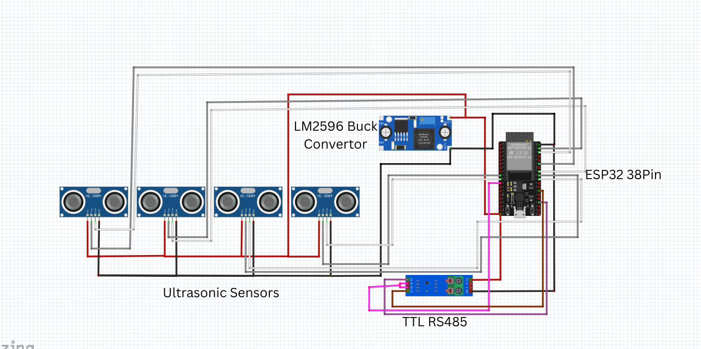

# 🚌 Bus Passenger Monitoring System

A real-time **IoT-based passenger monitoring system** for buses, built using **ESP32, ultrasonic sensors, RS485 communication, A9G GPS module, and MQTT**.  

This project enables accurate passenger entry/exit detection and real-time bus tracking, with data published to an MQTT broker for analytics.

---

## 🔧 System Overview

- **Total Sensors:** 8 Ultrasonic sensors  
- **Modules:**  
  - **Master Node**  
    - 4 Ultrasonic Sensors  
    - ESP32 Dev Board  
    - RS485 TTL Module (to communicate with Slave)  
    - A9G Module (GPS + GSM/GPRS)  
    - MQTT Client (publishes data)  
  - **Slave Node**  
    - 4 Ultrasonic Sensors  
    - ESP32 Dev Board  
    - RS485 TTL Module (to send data to Master)  

---
## 🖼️ Wiring Diagram

Here’s the wiring diagram for the **Bus Passenger Monitoring System**:  



---

## 🖼️ System Architecture



---


## 📡 Data Flow

```mermaid
graph TD
A[Slave ESP32 + 4 Ultrasonic Sensors] -->|RS485| B[Master ESP32 + 4 Ultrasonic Sensors]
B -->|GPS Data from A9G| C[(Data Processing in Master)]
C -->|MQTT Publish| D[Cloud Broker / Dashboard]
